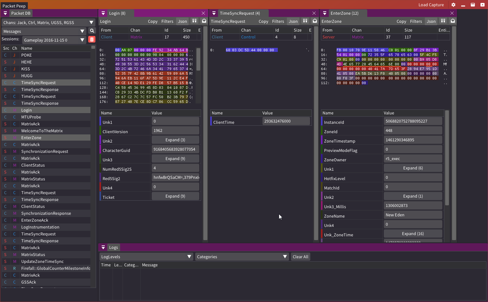
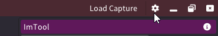

# PacketPeep 

Packet Peep is a research and network debugger.

Packet Peep loads network captures in ``.pcap``, ``.faucap`` format as well as the games ``.nsr`` replays.

You can then search and filter those messages and load into an inspector with the hex view as well as the parsed output from a loaded dll.

# Features
* Loading ``pcap``
* Loading ``faucap``
* Loading ``nsr``
* Filter by controller and message id, channel, and direction
* Inspect the Hex values
* Multiple windows for comparing messages
* Loading packet parsers from a DLL as well as hot reloading on that DLL change.
  * Allows rich parsing and viewing of those message definitions.
* Copy message data as, ``C# byte array``, ``JS byte array`` or as ``json`` output.
* Rich query window ``Magic Query`` lets you query all loaded message in a capture with a Linq query.

# Setup
* Download a release from here and extract some where.
* Open the settings UI 
  * Clone the ``https://github.com/themeldingwars/PacketPeepData/tree/aero`` (make sure its the Aero branch)
  * Compile it
  * Set the path to the output dll into Packet Peeps Settings
* Load a packet capture from the ``Load Capture`` button on the top right.
* When the capture is load you should see the messages in the left panel.
  * Double click one to open the inspector, if all went well you should see the hex view and the parsed output below like the screenshot above.

# Hot Reloading
Packet Peep can hot reload the ``AeroMessage.dll`` when it changes and refresh the views.

All you should need to do is make some changes to that project and recompile to see the changes.

This is great for quick changes

# Related Projects
* [Aero](https://github.com/themeldingwars/Aero) Source generator used for the message classes
* [Packet Peep Data](https://github.com/themeldingwars/PacketPeepData/tree/aero) Where the packet definitions go
* [Protocol Data](https://github.com/themeldingwars/Sift)
* [Wiki and some packet captures](https://github.com/themeldingwars/Documentation)

This project was created for educational purposes only.